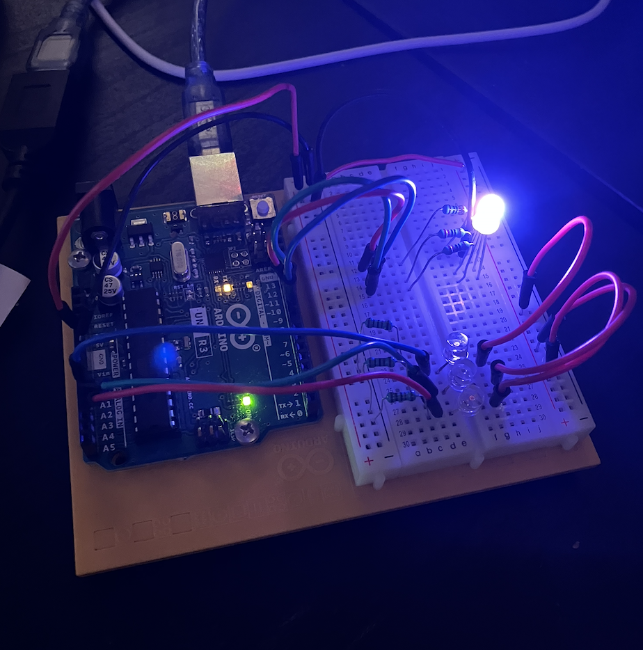
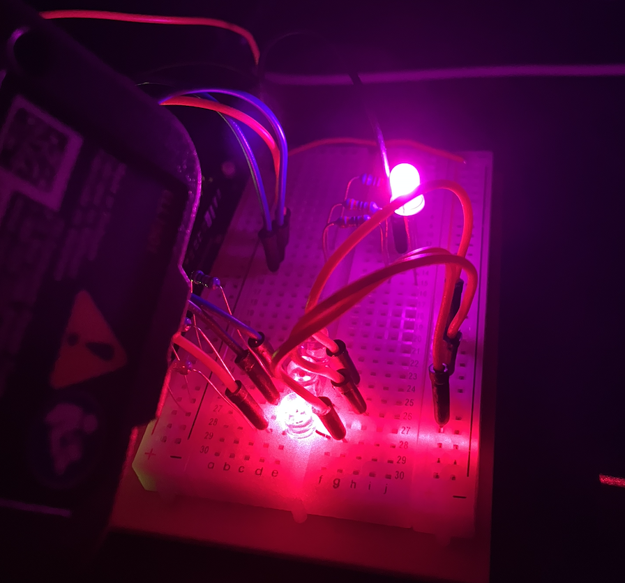
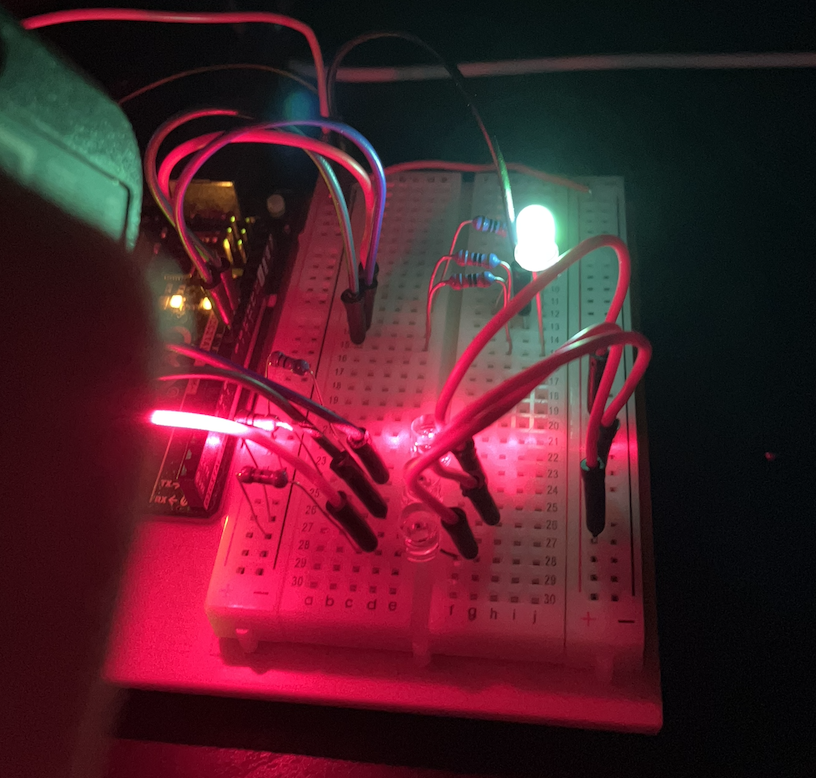
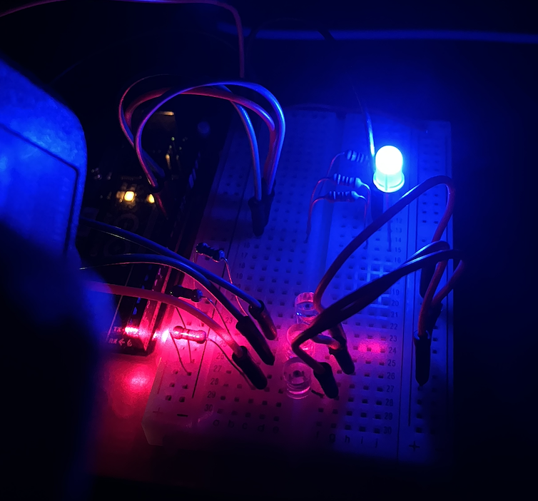
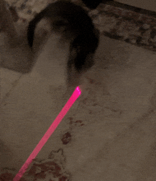

# Color Mixing Lamp
This week I'm making the color mixing lamp!

I build the circuit and set the red, green, and blue to make sure the light was connected correctly:

Then I added the code and let it run!

To make sure it was working, I shined a laser on each photosensor and reviewed the lamp output. I didn't have the gels, so I was able to use my red laser level just fine.

Red:

Green:

Blue:

This was also Charlie's favorite part of the build.
