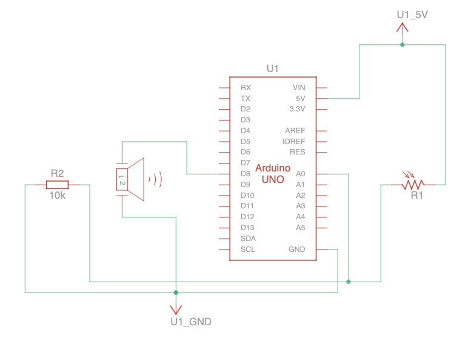
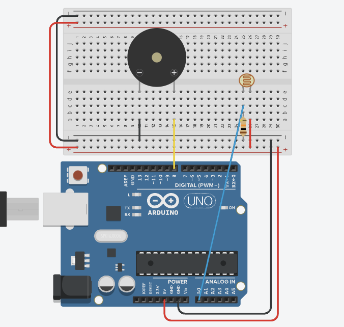
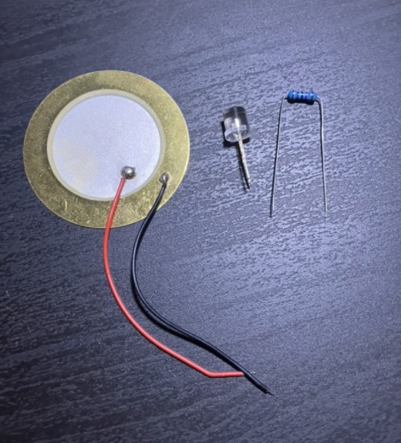
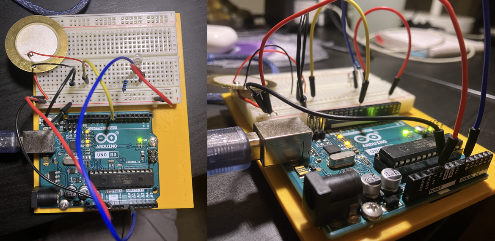
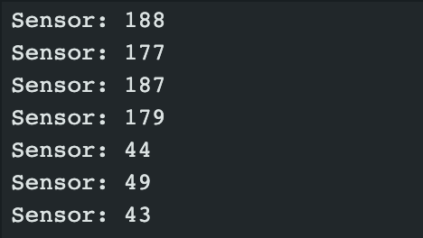

# Mood Cue

This week I am making the Light Theremin!

## Parts

For this project, I'll need the following parts: 

|Part|Quantity|
|-|-|
|Arduino Uno|1|
|Piezo|1|
|Light Sensor|1|
|10 k&ohm; Resistor|1|

## Schematic

When finished the circuit will look like this:





## Process
I started by mocking up the project in Tinkercad and gathering together all the parts I would need!



Then I built the circuit:



I tested that both components were working using this code:
```c++
int piezoPin = 8;
int sensorPin = A0;

void setup() {
  pinMode(piezoPin, OUTPUT);
  pinMode(sensorPin, INPUT);
  Serial.begin(9600);

  tone(piezoPin, 440);
}

void loop() {
  Serial.print("Sensor: ");
  Serial.println(analogRead(sensorPin));
}
```

Sure enough, the piezo was buzzing and I was getting good readings from the sensor when turning my desk light on and off:

 

## Software
Now that the circuit is finished, it's time to load in the software.

This is my starter code. I've tweaked the pitch numbers so it's not as high-pitched.
```c++
int sensorPin = A0;
int piezoPin = 8;

int sensorValue;
int sensorLow = 1023;
int sensorHigh = 0;
const int ledPin = 13;

void setup() {
  pinMode(ledPin, OUTPUT);
  pinMode(piezoPin, OUTPUT);
  pinMode(sensorPin, INPUT);

  // calibrating...
  digitalWrite(ledPin, HIGH);
  while (millis() < 5000) {
    sensorValue = analogRead(sensorPin);
    if (sensorValue > sensorHigh) {
      sensorHigh = sensorValue;
    }
    if (sensorValue < sensorLow) {
      sensorLow = sensorValue;
    }
  }
  digitalWrite(ledPin, LOW);
}

void loop() {
  sensorValue = analogRead(sensorPin);

  int pitch =
    map(sensorValue, sensorLow, sensorHigh, 50, 1760);
  tone(piezoPin, pitch, 20);
  delay(10);
}
```

I really didn't like how choppy it sounded so I've added some smoothing via moving-average. This is my final code:
```c++
int sensorPin = A0;
int piezoPin = 8;

int sensorValue;
int sensorLow = 1023;
int sensorHigh = 0;
const int ledPin = 13;

int pastValues[30] = { };

void setup() {
  pinMode(ledPin, OUTPUT);
  pinMode(piezoPin, OUTPUT);
  pinMode(sensorPin, INPUT);

  // calibrating...
  digitalWrite(ledPin, HIGH);
  while (millis() < 5000) {
    sensorValue = analogRead(sensorPin);
    if (sensorValue > sensorHigh) {
      sensorHigh = sensorValue;
    }
    if (sensorValue < sensorLow) {
      sensorLow = sensorValue;
    }
  }
  digitalWrite(ledPin, LOW);
}

void loop() {
  sensorValue = analogRead(sensorPin);

  for (int i = 1; i < 30; i++) {
    pastValues[i - 1] = pastValues[i];
  }

  pastValues[29] = sensorValue;

  int average = 0;
  for (int value : pastValues) {
    average += value;
  }
  average /= 30;

  int pitch =
    map(average, sensorLow, sensorHigh, 50, 1760);
  tone(piezoPin, pitch, 20);
  delay(10);
}
```

And here's what it sounds like! \
https://github.com/user-attachments/assets/b901295a-be9b-4d0b-90f3-ac6e718f4b9b


