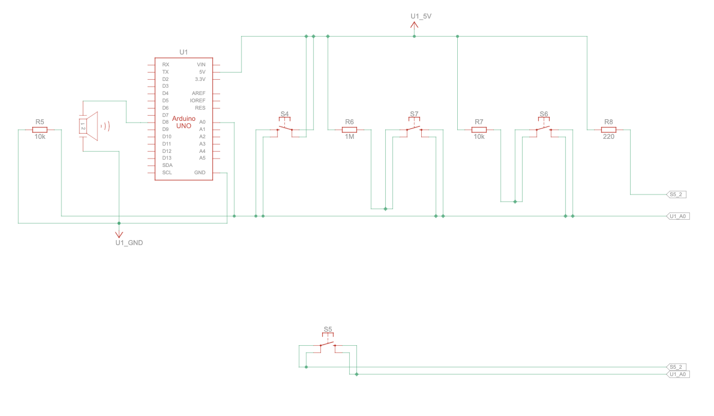
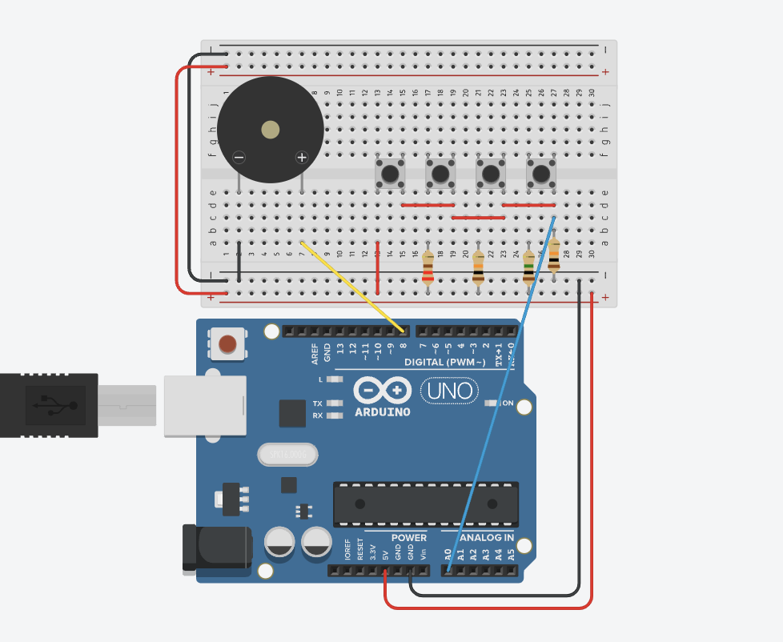
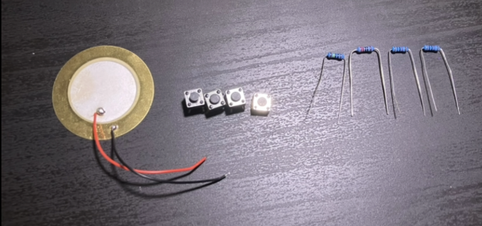
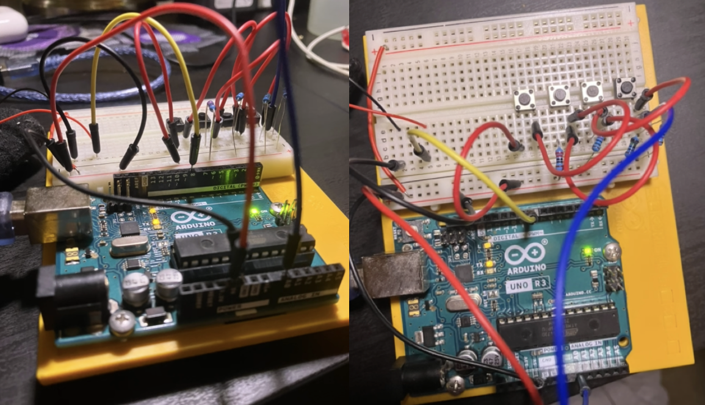
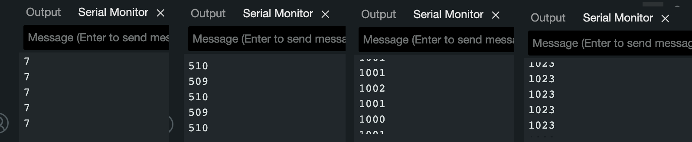

# Keyboard Instrument

This week I am making the Keyboard Instrument!

## Parts

For this project, I'll need the following parts: 

|Part|Quantity|
|-|-|
|Arduino Uno|1|
|Piezo|1|
|Button|4|
|10 k&ohm; Resistor|2|
|1 M&ohm; Resistor|1|
|220 &ohm; Resistor|1|

## Schematic

When finished the circuit will look like this:





## Process
I started by mocking up the project in Tinkercad and gathering together all the parts I would need!



Then I built the circuit:



I tested that both components were working using this code:
```c++
int buttonsPin = A0;
int piezoPin = 8;

void setup() {
  pinMode(piezoPin, OUTPUT);
  pinMode(buttonsPin, INPUT);

  tone(piezoPin, 220);
  Serial.begin(9600);
}

void loop() {
  int buttonsValue = analogRead(buttonsPin);
  if (buttonsValue > 0)
    Serial.println(buttonsValue);
}
```

I confirmed that the piezo was buzzing and each button gave a different output.

 

## Software
Now that the circuit is finished, it's time to load in the software.

This is my starter code. I changed the notes so I could play a song:
```c++
int notes[] = { 440, 495, 550, 660 };

void setup() {
  Serial.begin(9600);
}

void loop() {
  int keyVal = analogRead(A0);
  Serial.println(keyVal);
  if (keyVal == 1023) {
    tone(8, notes[0]);
  } else if (keyVal >= 990 && keyVal <= 1010) {
    tone(8, notes[1]);
  } else if (keyVal >= 505 && keyVal <= 515) {
    tone(8, notes[2]);
  } else if (keyVal >= 5 && keyVal <= 10) {
    tone(8, notes[3]);
  } else {
    noTone(8);
  }
}
```

And here's what it sounds like! 

https://github.com/user-attachments/assets/bee78fd0-a13d-4536-85d4-8649f70aad7f
