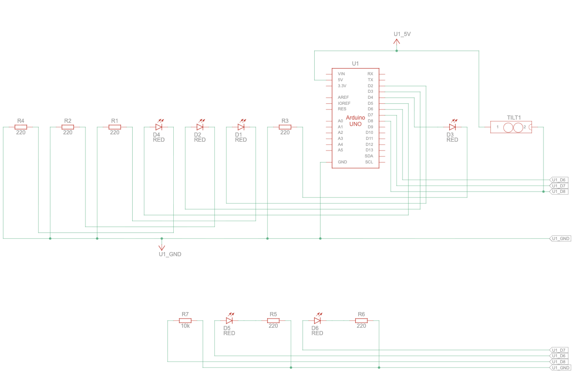
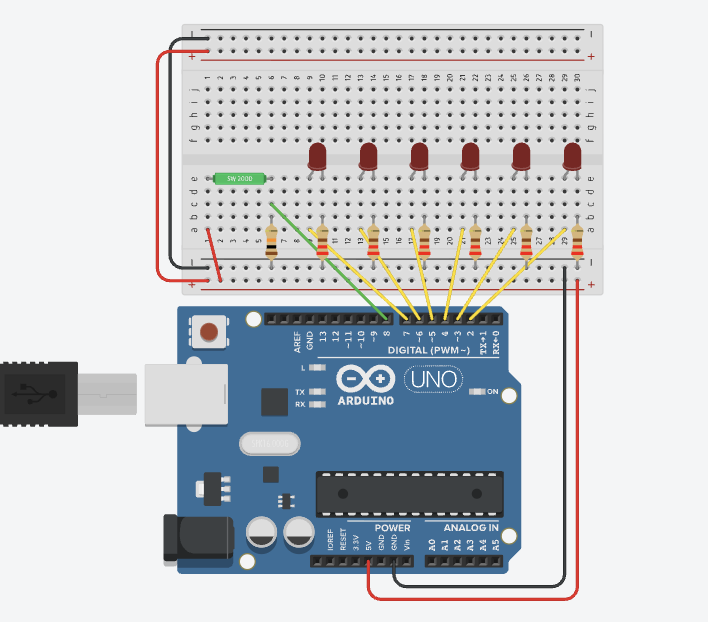
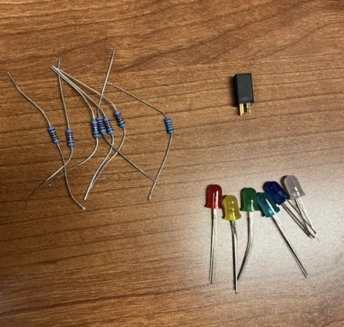
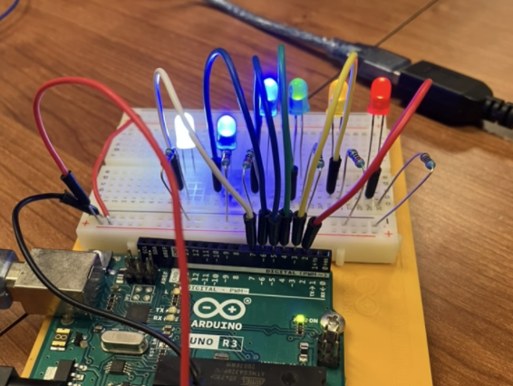

# Digital Hourglass

This week I am making the Digital Hourglass!

## Parts

For this project, I'll need the following parts: 

|Part|Quantity|
|-|-|
|Arduino Uno|1|
|LED|6|
|Tilt Switch|1|
|10 k&ohm; Resistor|1|
|220 &ohm; Resistor|6|

## Schematic

When finished the circuit will look like this:




## Process
I started by mocking up the project in Tinkercad and gathering together all the parts I would need!


I first added all the LEDs and used this code to make sure they were all connected right:

```c++
int ledPins[] = { 7, 6, 5, 4, 3, 2 };

void setup() {
  for (int pin : ledPins) {
    pinMode(pin, OUTPUT);
    digitalWrite(pin, HIGH);
  }
}
```


Then I added the tilt switch:


## Software
Now that the circuit is finished, it's time to load in the software.

This is my code. I changed the interval so that it moves faster and I added a little sequence at the end!
```c++
int ledPins[] = { 7, 6, 5, 4, 3, 2 };
int sensorPin = 8;
int led = 2;

unsigned long previousTime = 0;
int switchState = 0;
int prevSwitchState = 0;
long interval = 1000;

void setup() {
  for (int pin : ledPins) {
    pinMode(pin, OUTPUT);
  }

  pinMode(sensorPin, INPUT);

  Serial.begin(9600);
}

void loop() {
  unsigned long currentTime = millis();
  if (currentTime - previousTime > interval) {
    previousTime = currentTime;
    digitalWrite(led, HIGH);
    led++;
    if (led == 7) {
      for (int i = 0; i < 10; i++) {
        for (int pin : ledPins) {
          digitalWrite(pin, LOW);
          delay(25);
        }

        for (int pin : ledPins) {
          digitalWrite(pin, HIGH);
          delay(25);
        }
      }
    }
  }

  switchState = digitalRead(sensorPin);
  if (switchState != prevSwitchState) {
    for (int pin : ledPins) {
      digitalWrite(pin, LOW);
    }
    led = 2;
    previousTime = currentTime;
  }
  prevSwitchState = switchState;
}
```

And here's what it looks like!