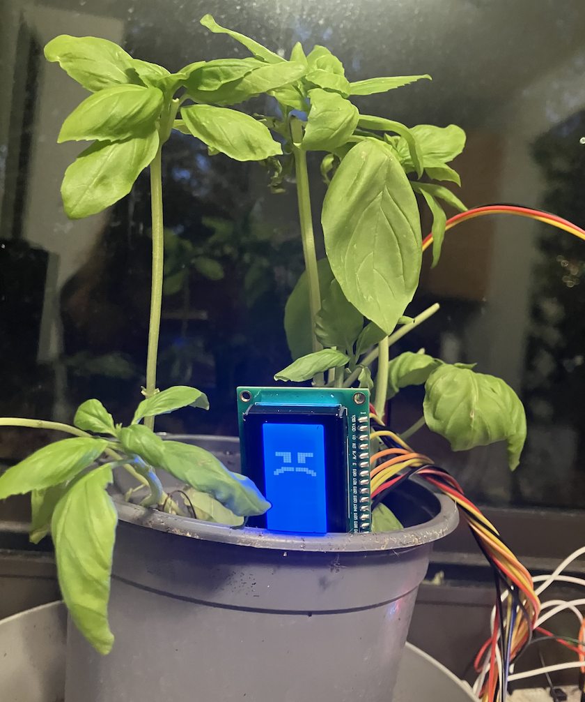
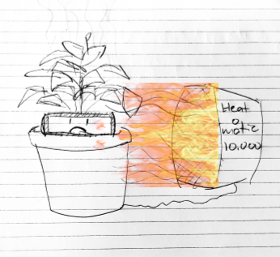
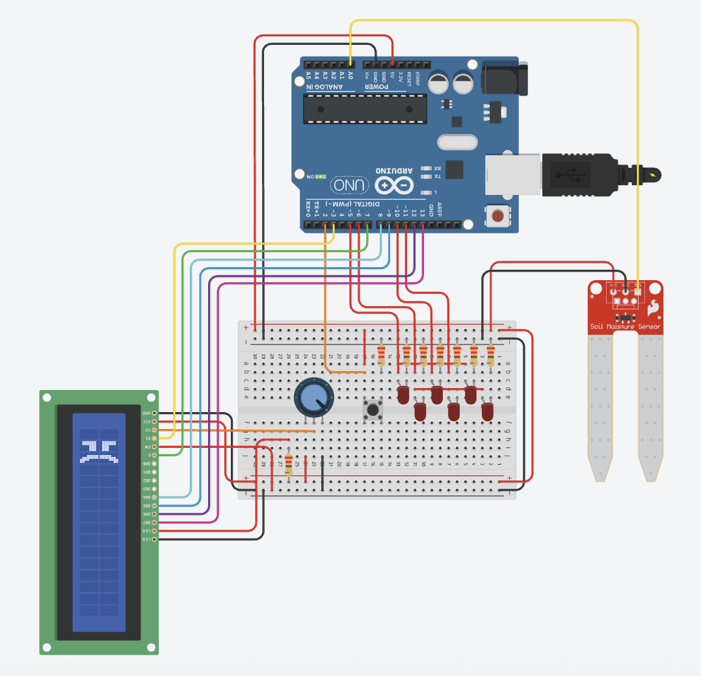
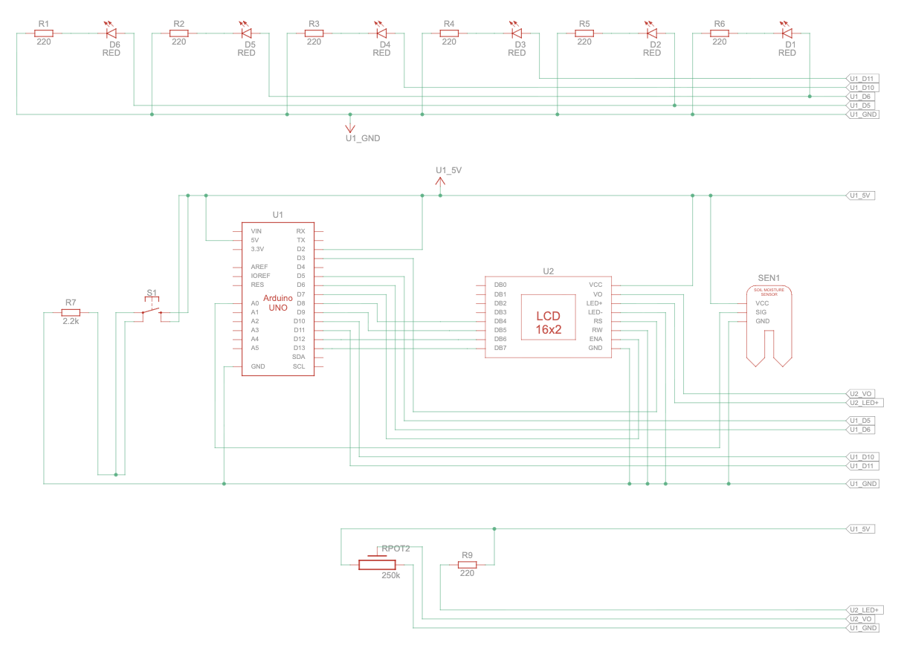
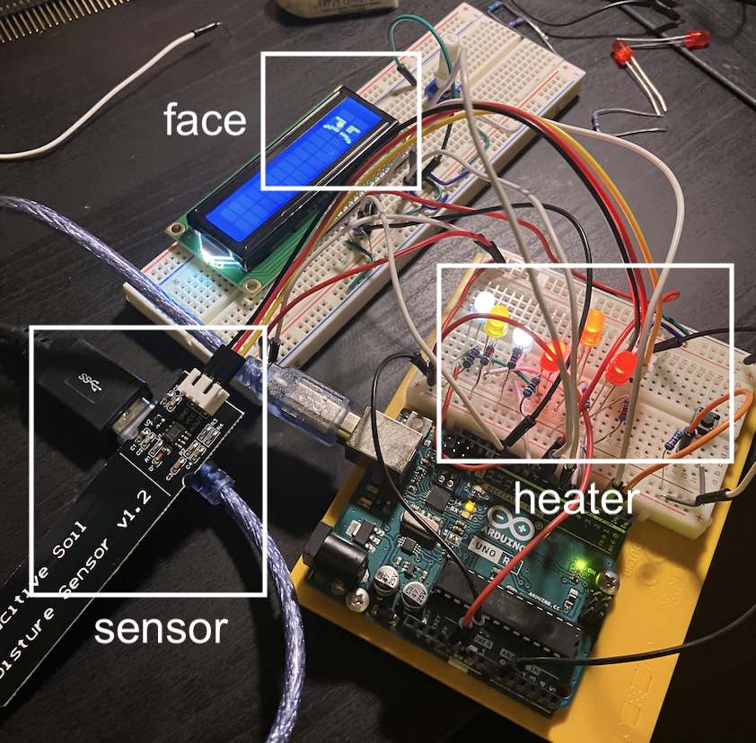
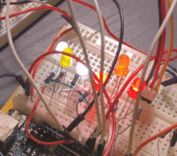
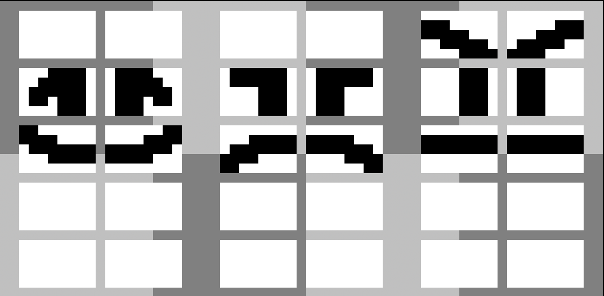
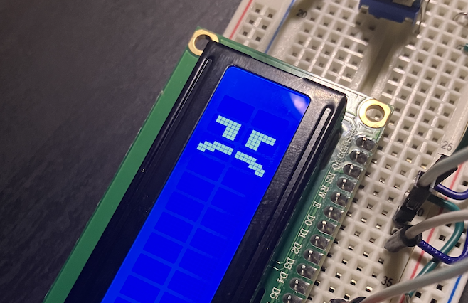
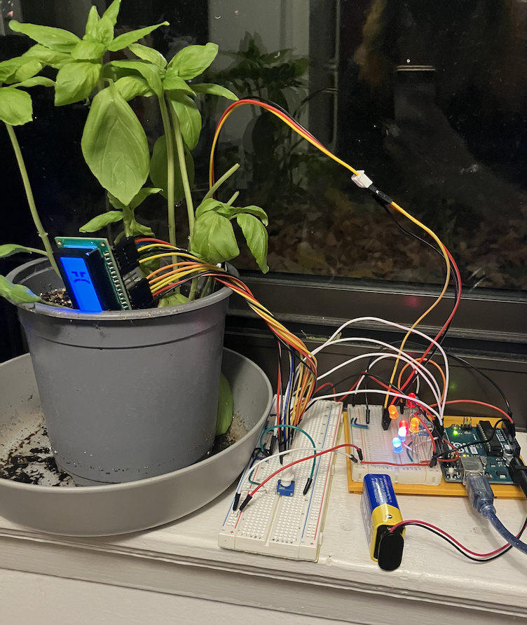
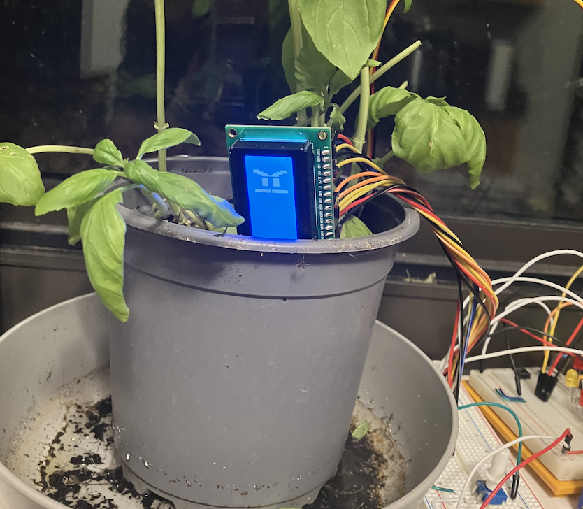

# Depressed Plant 🪴
Everyone makes a plant that waters itself, but what about one that does the opposite?

[See it in action!](https://youtu.be/iVa_hGkkVOE)



## The Idea
My plant wants nothing but release from this cruel world, and to accomplish this, it's hacked into my heating! Every time I water it, it blasts the heat to try to dry itself out! It's up to me to keep my plant alive and well!



## Circuit and Parts
The completed circuit will look like this:  



You'll need the following parts:  
|Part|Quantity|
|-|-|
|Arduino Uno|1|
|LED|6|
|220 &ohm; Resistor|7|
|2.2 k&ohm; Resistor|1|
|Potentiometer|1|
|Button|1|
|LCD Screen|1|
|Soil Moisture Sensor|1|


## Process
I started by connecting the LCD, heater LEDs, and the moisture sensor.  
 

I programmed LEDs with individual delays to flash in and out to mimic the appearance of a heater.  


Then I created three different faces for the LCD screen and added code to print them to the screen.  



Once I had everything ready, all I had to do was write the program!

Main Program:
```c++
#include <LiquidCrystal.h>

int ledPins[] = { 5, 6, 10, 11 };
int buttonPin = 2;
int sensorPin = A0;

const int sensorLow = 415;
const int sensorHigh = 80;

const int happyMax = 40;
const int heaterMin = 60;


bool isHeating = false;
const long heaterCooldown = 300000; // 5 * 60 * 1000
long cooldownStartedAt = -1 * heaterCooldown;

const int rs = 3, en = 7, d4 = 8, d5 = 9, d6 = 12, d7 = 13;
LiquidCrystal lcd(rs, en, d4, d5, d6, d7);

void setup() {
  for (int pin : ledPins) {
    pinMode(pin, OUTPUT);
    analogWrite(pin, 255);
  }

  pinMode(buttonPin, INPUT);
  pinMode(sensorPin, INPUT);

  Serial.begin(9600);
  lcd.begin(16, 2);

  frown(lcd);
}

void loop() {
  int moisture = map(analogRead(sensorPin), sensorLow, sensorHigh, 0, 100);

  // turn heater leds on and off
  if (!isHeating) {
    shutOffHeater();
  } else {
    updateHeater();
  }

  // during cooldown
  if (millis() - cooldownStartedAt < heaterCooldown) {
    scowl(lcd);
    int secondsLeftOnCooldown = (heaterCooldown - (millis() - cooldownStartedAt)) / 1000;
  }

  // not on cooldown
  if (millis() - cooldownStartedAt > heaterCooldown) {
    if (moisture > happyMax) {
      frown(lcd);
    } else {
      smile(lcd);
    }

    if (moisture > heaterMin) {
      isHeating = true;
    } else {
      isHeating = false;
    }
  }

  if (digitalRead(buttonPin) == HIGH) {
    isHeating = false;
    cooldownStartedAt = millis();
    scowl(lcd);
  }
}

void updateHeater() {
  for (int pin : ledPins) {
    analogWrite(pin, random(0, 100));
  }
}

void shutOffHeater() {
  for (int pin : ledPins) {
    analogWrite(pin, 0);
    delay(50);
  }
}
```
and the faces:
```c++
#include <LiquidCrystal.h>

byte sadLeftEye[8] = {
  0b00000,
  0b11111,
  0b11111,
  0b11111,
  0b11000,
  0b11000,
  0b11000,
  0b00000
};

byte sadRightEye[8] = {
  0b00000,
  0b11000,
  0b11000,
  0b11000,
  0b11111,
  0b11111,
  0b11111,
  0b00000
};

byte sadLeftFrown[8] = {
  0b01100,
  0b01100,
  0b01100,
  0b01100,
  0b01110,
  0b00110,
  0b00111,
  0b00011
};

byte sadRightFrown[8] = {
  0b00011,
  0b00111,
  0b00110,
  0b01110,
  0b01100,
  0b01100,
  0b01100,
  0b01100
};

byte angryLeftEyebrow[8] = {
  0b00001,
  0b00011,
  0b00011,
  0b00111,
  0b00110,
  0b01110,
  0b01100,
  0b01100
};

byte angryRightEyebrow[8] = {
  0b01100,
  0b01100,
  0b01110,
  0b00110,
  0b00111,
  0b00011,
  0b00011,
  0b00001
};

byte angryLeftEye[8] = {
  0b00000,
  0b11111,
  0b11111,
  0b11111,
  0b00000,
  0b00000,
  0b00000,
  0b00000
};

byte angryRightEye[8] = {
  0b00000,
  0b00000,
  0b00000,
  0b00000,
  0b11111,
  0b11111,
  0b11111,
  0b00000
};

byte angryFrown[8] = {
  0b01100,
  0b01100,
  0b01100,
  0b01100,
  0b01100,
  0b01100,
  0b01100,
  0b01100
};

byte happyLeftEye[8] = {
  0b00000,
  0b11111,
  0b11111,
  0b11111,
  0b11100,
  0b01110,
  0b00110,
  0b00000
};

byte happyRightEye[8] = {
  0b00000,
  0b00110,
  0b01110,
  0b11100,
  0b11111,
  0b11111,
  0b11111,
  0b00000
};

byte happyLeftSmile[8] = {
  0b00110,
  0b00110,
  0b00110,
  0b00110,
  0b01110,
  0b01100,
  0b11100,
  0b11000
};

byte happyRightSmile[8] = {
  0b11000,
  0b11100,
  0b01100,
  0b01110,
  0b00110,
  0b00110,
  0b00110,
  0b00110
};

void smile(LiquidCrystal lcd) {
  lcd.createChar(0, happyLeftEye);
  lcd.createChar(1, happyRightEye);
  lcd.createChar(2, happyLeftSmile);
  lcd.createChar(3, happyRightSmile);

  lcd.clear();

  lcd.setCursor(1, 0);
  lcd.write(1);
  lcd.write(3);

  lcd.setCursor(1, 1);
  lcd.write(byte(0));
  lcd.write(2);
}

void frown(LiquidCrystal lcd) {
  lcd.createChar(0, sadLeftEye);
  lcd.createChar(1, sadRightEye);
  lcd.createChar(2, sadLeftFrown);
  lcd.createChar(3, sadRightFrown);
  
  lcd.clear();

  lcd.setCursor(1, 0);
  lcd.write(1);
  lcd.write(3);

  lcd.setCursor(1, 1);
  lcd.write(byte(0));
  lcd.write(2);
}

void scowl(LiquidCrystal lcd) {
  lcd.createChar(0, angryLeftEyebrow);
  lcd.createChar(1, angryRightEyebrow);
  lcd.createChar(2, angryLeftEye);
  lcd.createChar(3, angryRightEye);
  lcd.createChar(4, angryFrown);

  lcd.clear();

  lcd.setCursor(0, 0);
  lcd.write(1);
  lcd.write(3);
  lcd.write(4);

  lcd.setCursor(0, 1);
  lcd.write(byte(0));
  lcd.write(2);
  lcd.write(4);
}
```

## Gallery
Sad with the heat on:  


Heater on in the dark:  


Mad after I shut off heater:  


Watering:  
