# Digital Graffiti
Have you ever wanted to be a graffiti artist without the legal trouble? Now you can!

## The Idea
Use a real spray paint can to draw graffiti in the digital world. 
  

## Circuit and Parts
The completed circuit will look like this:  
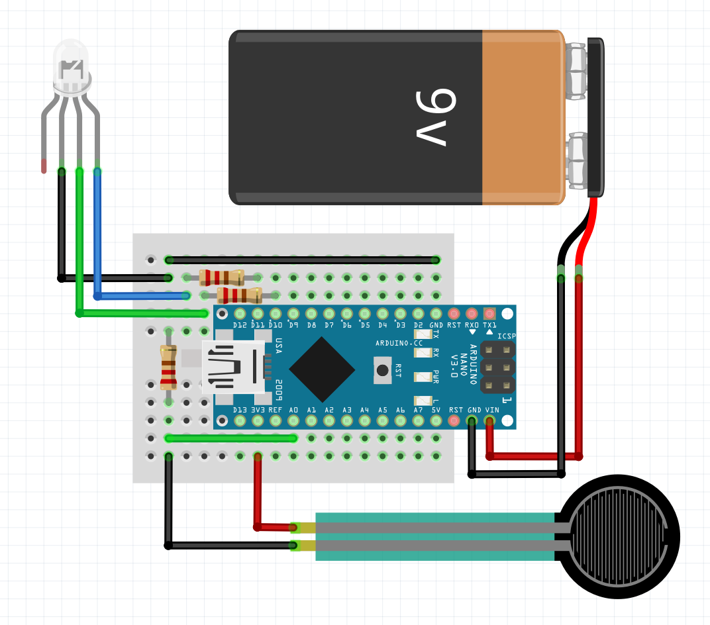
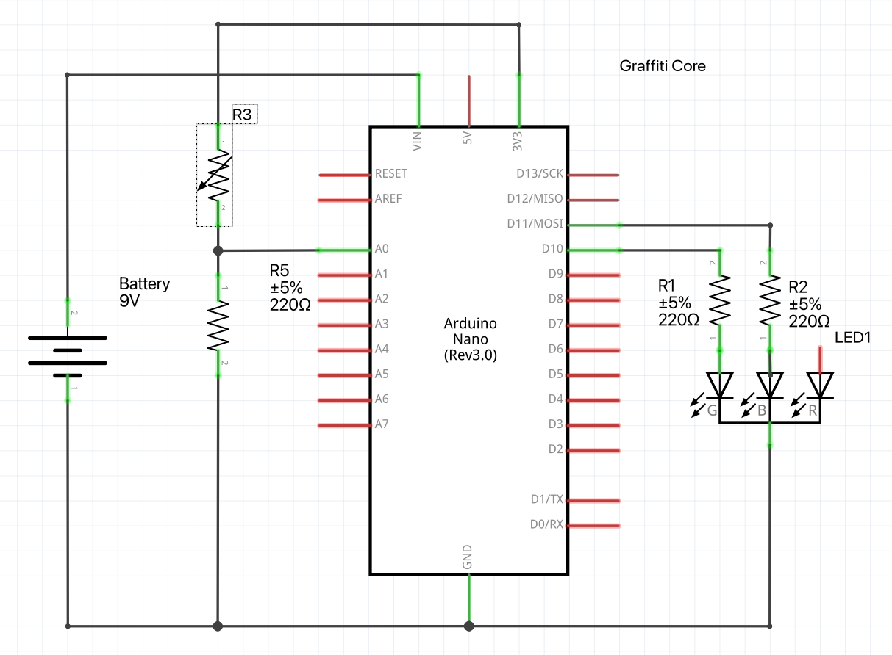

You'll need the following parts:  
|Part|Quantity|
|-|-|
|Arduino Nano|1|
|9V Battery|1|
|Battery Connector|1|
|RGB LED|1|
|220 &ohm; Resistor|3|
|18mm &#x2300; Force Sensitive Resistor|1|
|10mm &#x2300; Spring|1|
|Female Spray Cap|1|
|Spray Paint Can|1|
|Webcam|1|
|Sunglasses|2|

## Process
I got started by modeling a spray paint can that I could use to contain my circuit.  
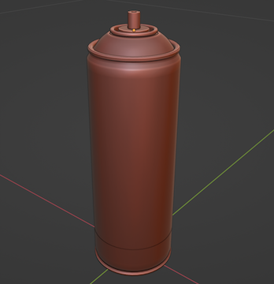
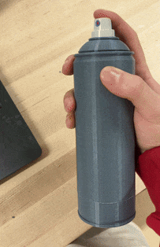  

Meanwhile, I got started on the camera end. I intended to use an LED in the cap to track its position. The LED would change colors according to the cap pressure so that it would be visible even while not pressed. Unfortunately, all the background noise was confusing the tracking.  

I couldn't manually adjust the exposure of my webcam, so my solution was to pop out the lenses of a pair of sunglasses and tape them over the camera!  
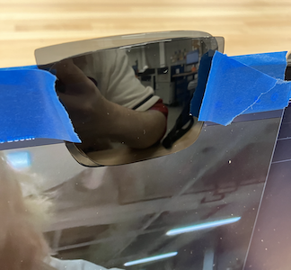
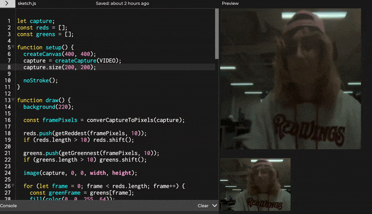  

With the LED tracking working, I could move onto the cap pressure tracking.  
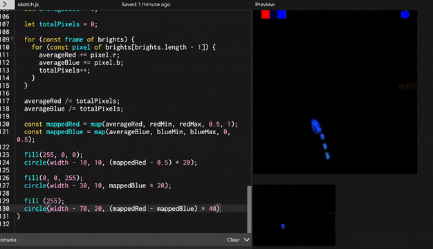  

Moving on, I started working on being able to actually draw lines! The initial strokes weren't very smooth so I improved the interpolation.  
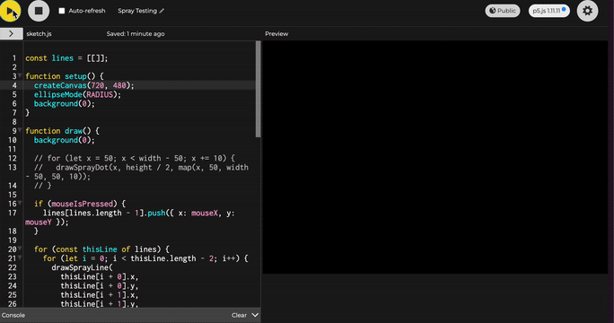  
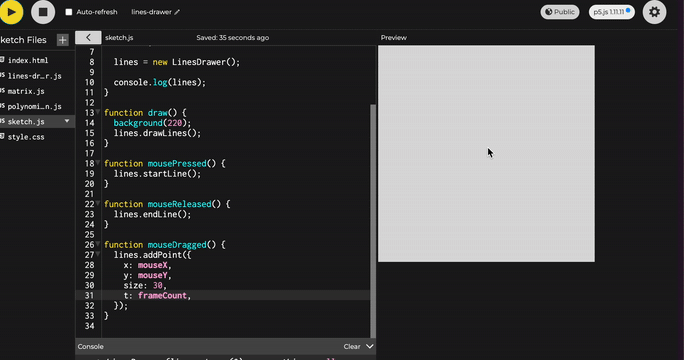  

Coming back to the spray can, I assembled the analog button using the spray cap, the spring, and the force sensitive resistor.  
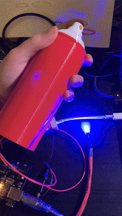  
After making some adjustments to the can and drilling some holes in the cap, I'm able to get the LED in place.  
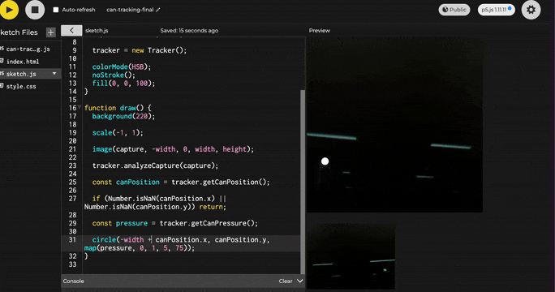

Until this point, I've been using my Arduino Uno which is convenient, but huge. I rewired everything to fit on my mini breadboard using an Arduino Nano:  
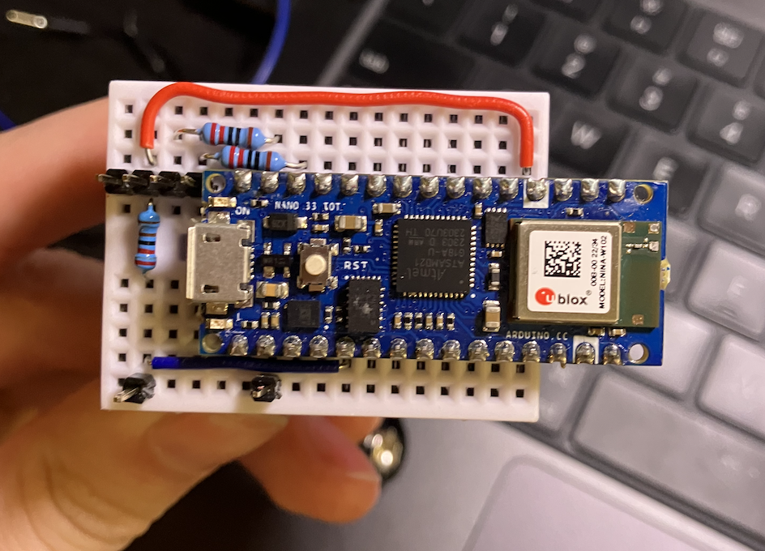  

With that finished, I was finally able to use the can without having it attached to my laptop.
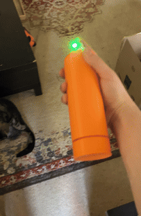

And with everything put together, digital graffiti is a reality!  
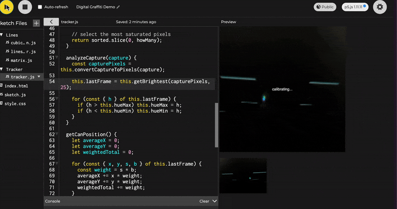  
