# Meds Trackers
I love taking my meds but I always forget to, and when I remember, I can't remember if I've already taken them

https://github.com/user-attachments/assets/c1f51df4-f794-489c-b553-40015e09d7d1

## The Idea
Use a custom holder that detects when your meds have been taken and alerts you when you forget.
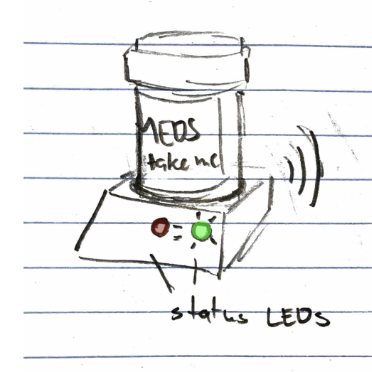 

## Circuit and Parts
The completed circuit will look like this:  
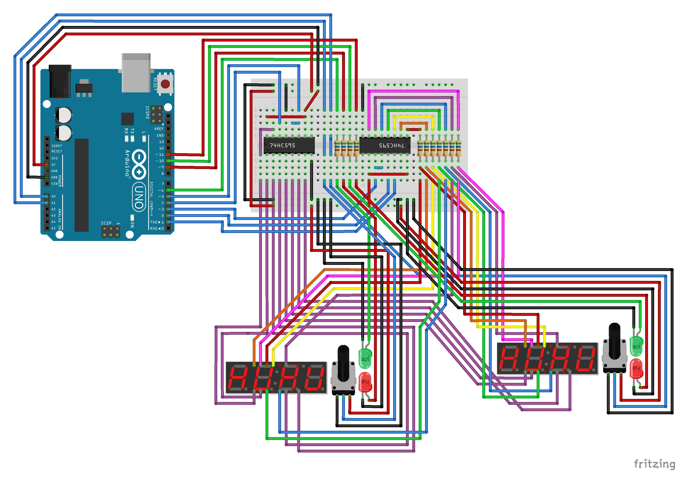
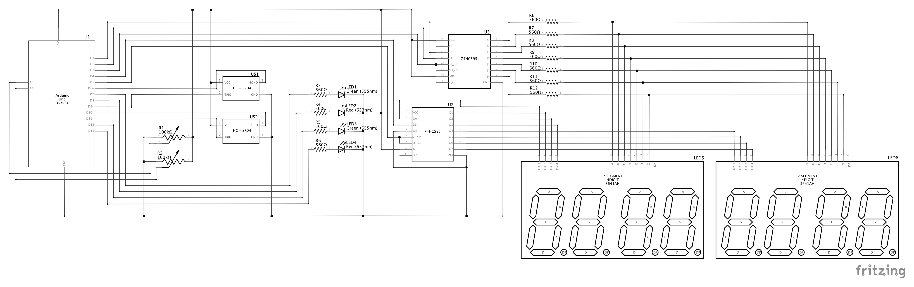

You'll need the following parts:  
|Part|Quantity|
|-|-|
|Arduino Uno|1|
|560&ohm; Resistor|11|
|3641AH 7-Segment Display|2|
|74HC595 Shift Register|2|
|Green LED|2|
|Red LED|2|
|Potentiometer|2|
|HC-SR04 Ultrasonic Sensor|2|
|Medication Vials|2|

## Process
To start, I picked up some vials from my local CVS. My boyfriend works a pharmacy technician so he was able to get me some but you can usually walk in and just ask for them.  

I initially intended to use a force sensor to detect the presence of the medication. Unfortunately, the vials weren't heavy enough to register.  

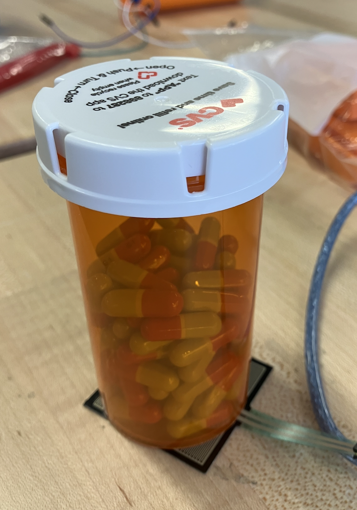  

I pivoted to using an ultrasonic sensor, and after confirming it worked inside the holder, I was all set to continue!

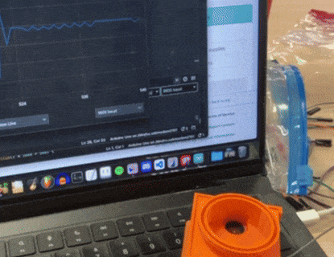  

After many revisions, I modeled and printed two versions of the holder, one for each size vial:  

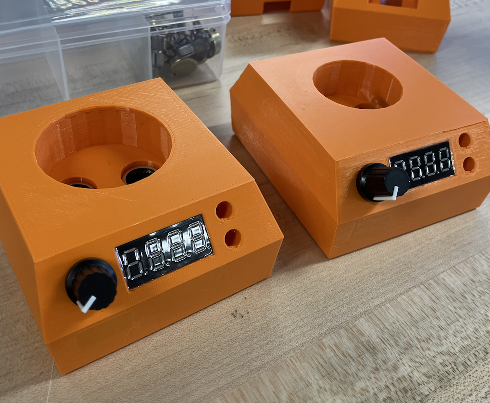  

Once that was set, I got started working on each part of the project.  

I setup the 7 segment display circuit and made sure it was able to display the numbers correctly  

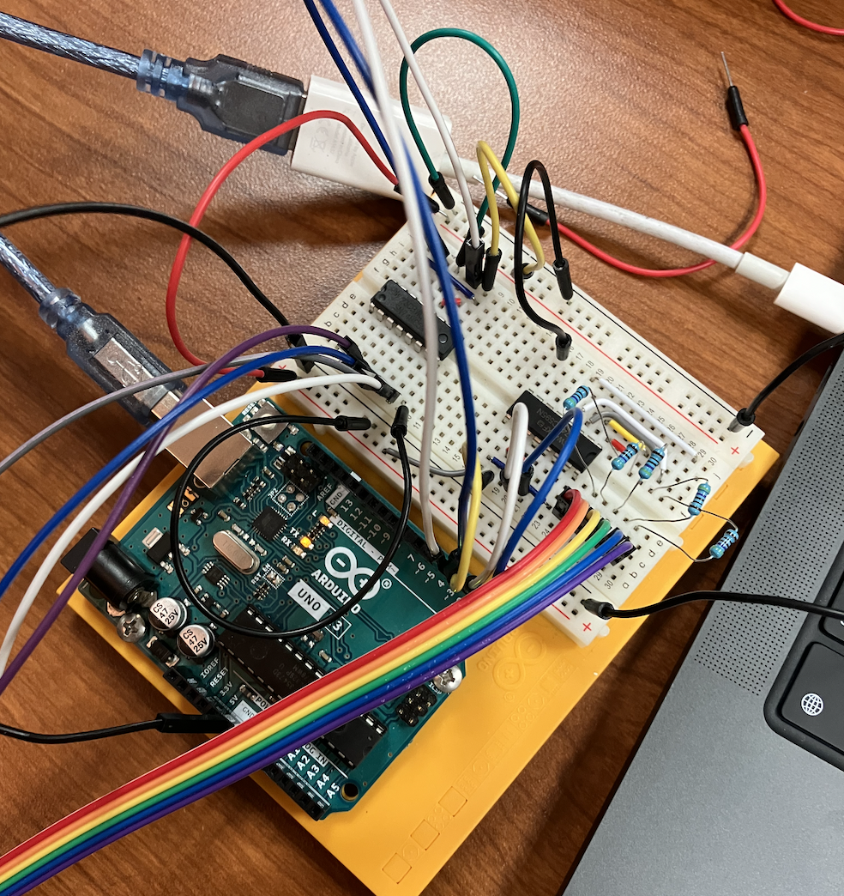  
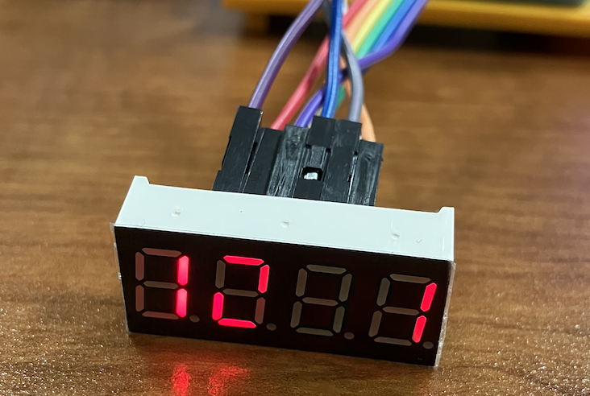  

Next I hooked up the potentiometers and the LEDs  

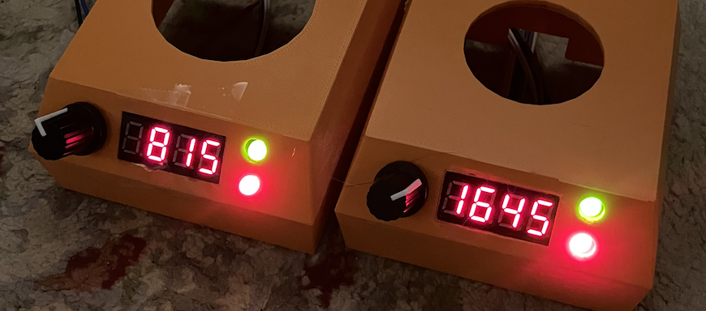  
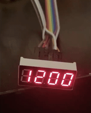  

All that's left was to connect the ultrasonic sensor and finish up the code.  

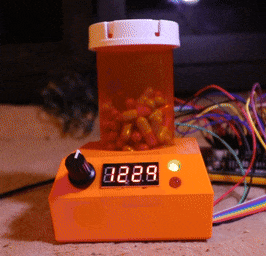
