# Super Duper Salt Shaker PRO

https://github.com/user-attachments/assets/77581143-478f-447b-b6cb-a4b1d90e9205

Inspired by games like Papa's Pizzeria and Cooking Mama, I've created my own cooking game with a custom controller!

In my project, YOU get to work at the last station in a restaurant kitchen! Customers want well salted dishes and it’s YOUR job to get it to them!

Utilize your trusty salt shaker and get to work!

## Circuit and Parts

### Circuit

The circuit for this project was relatively simple. Initially, I intended to use a tilt-switch, but I realized that my Arduino Nano has a built an accelerometer and chose to use that instead.

I've chosen not to use a breadboard, that way I could fit it inside my 3D printed housing.  
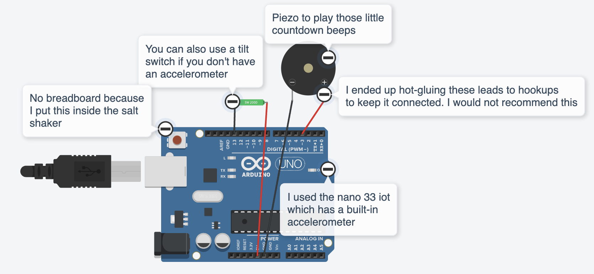  
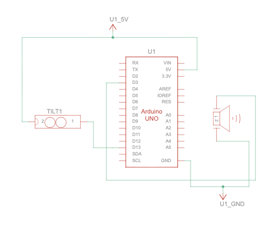

In addition to the accelerometer/tilt-switch, the circuit also uses a piezo buzzer for the beeps.

### Parts

This project requires a bit more than just your average Arduino project. You will need a salt shaker to place all the components inside. If you have a real salt shaker that you don't mind drilling a hole into, this is a great option and really enhances the immersion! I settled on 3D printing mine.

For this project, you'll need:
|Part|Quantity|
|-|-|
|Salt Shaker|1|
|Arduino Microcontroller|1|
|Accelerometer or Tilt Switch|1|
|Piezo|1|
|Long Cord|1|

> [!TIP]
> Some key considerations when choosing your parts:
>
> - For this project, I've found that using an accelerometer is not necessarily better than using a tilt switch.
> - Your salt shaker should be able to fit your Arduino, piezo, and sensor.
> - You'll need to drill a hole into the shaker for the cord to run out of. I drilled mine in the bottom. This made it easy to hold but impossible to set down standing up.

## Process

### The Salt Shaker

I started by creating a 3D model of a salt shaker.  
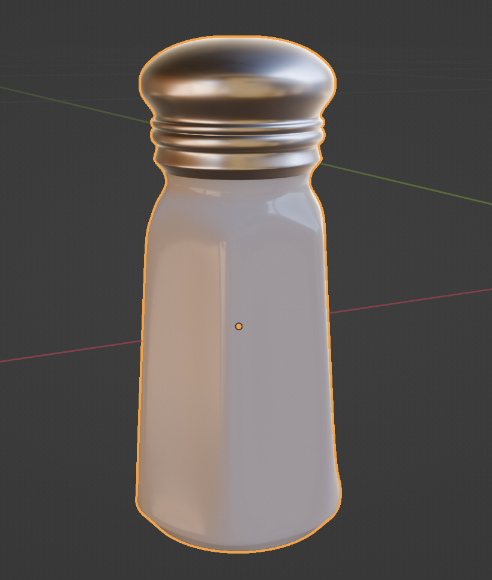  
I would use this model both to print and in the game.

I knew I would need to be able to get inside the salt shaker so before printing, I split the model in two.  
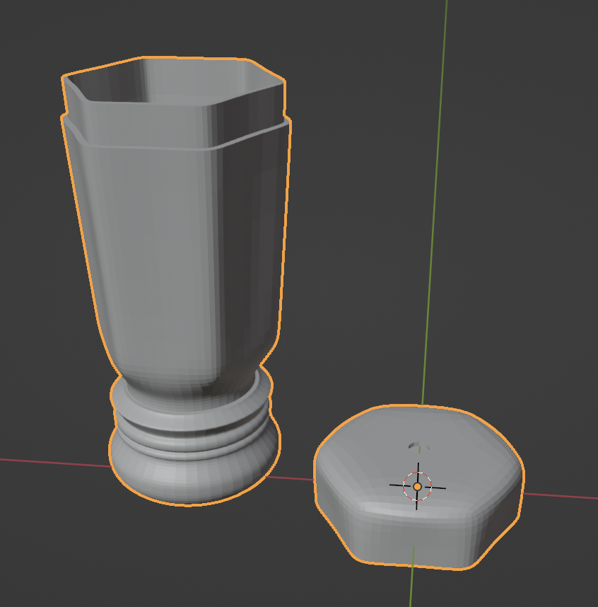

I also made some small inserts to hold all the pieces in place  
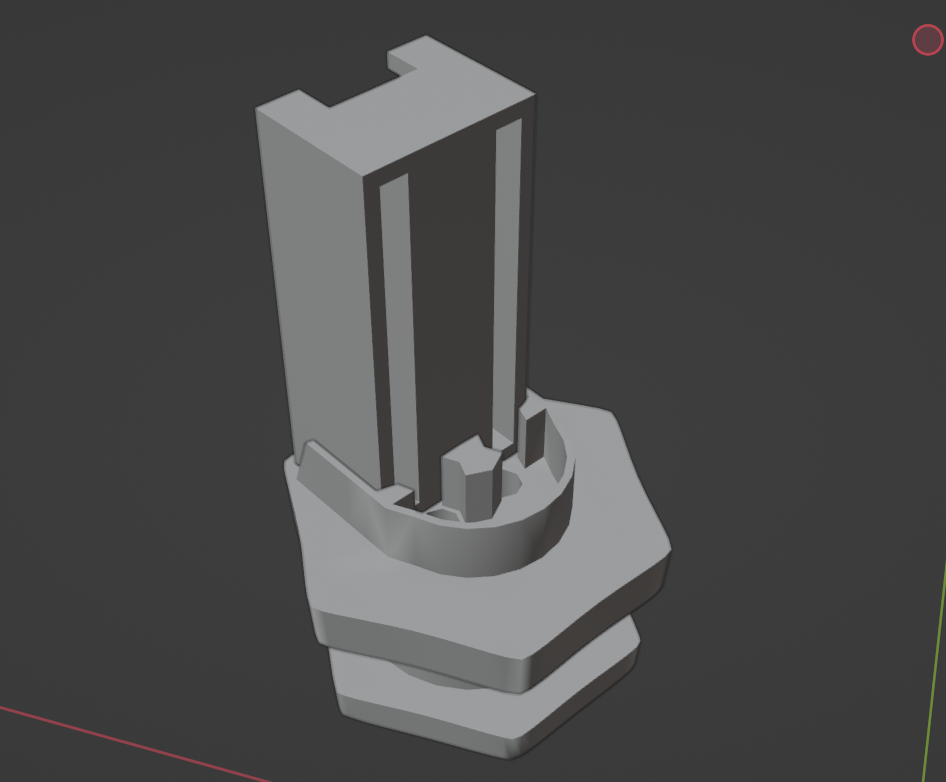

### The Delicious Food

Next was creating the dishes!

I started by modeling a simple plate.  
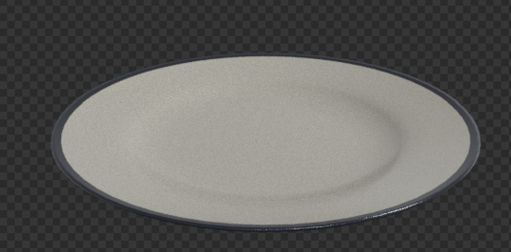

Then I scoured the depths of Flickr to find pictures of meals and put them on the plates!  
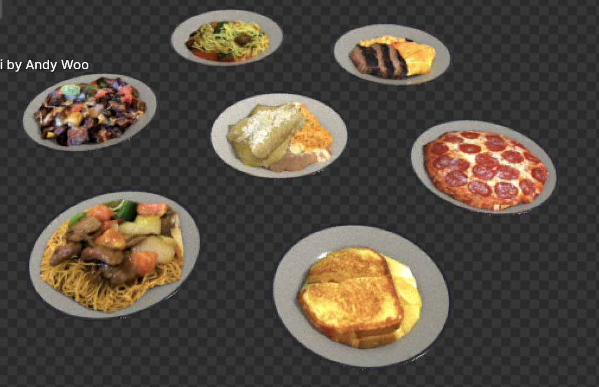

### The Game

I used Unity to create the game! I imported my shaker model and all my dishes.
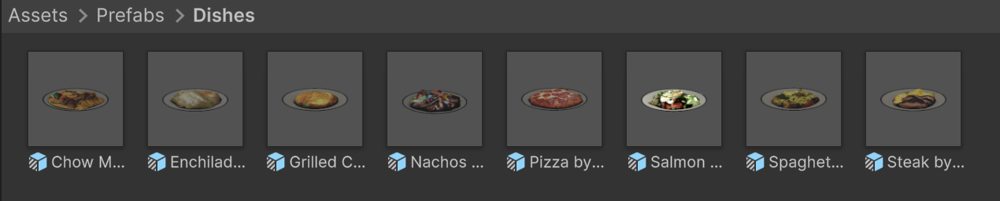

My game UI is placed in the scene on the plate! As the salt shaker travels around, you fill up each of four quadrants to the right amount; then your score is calculated based on evenness and saltiness.  
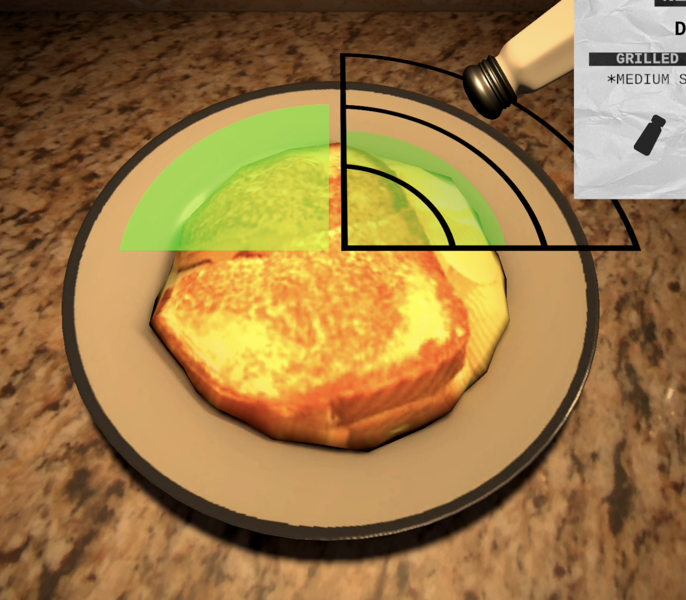

At the beginning of each round, you receive an order ticket with the customer's instructions. Then at the end you receive a receipt and tips based on how well you did!  
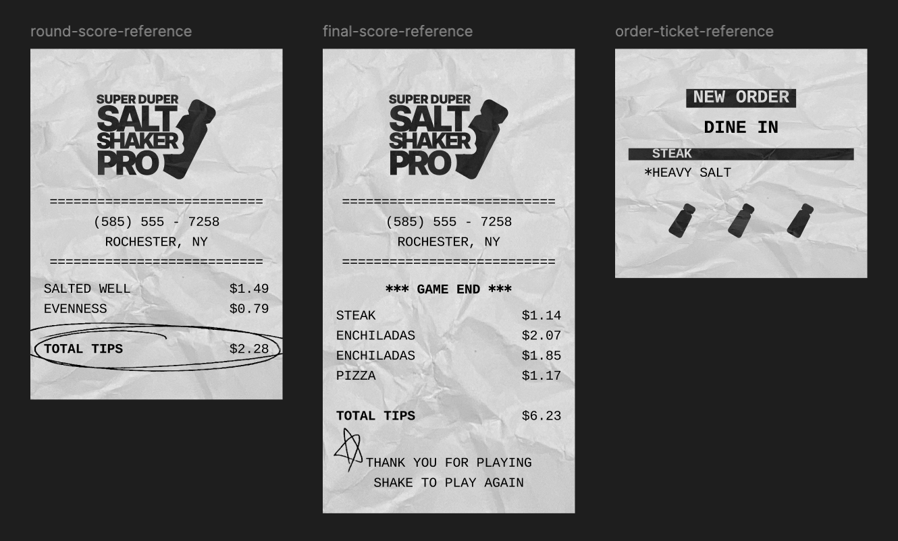

To polish everything, I added camera movements, warm restaurant lighting, and a kitchen countertop to work at.  
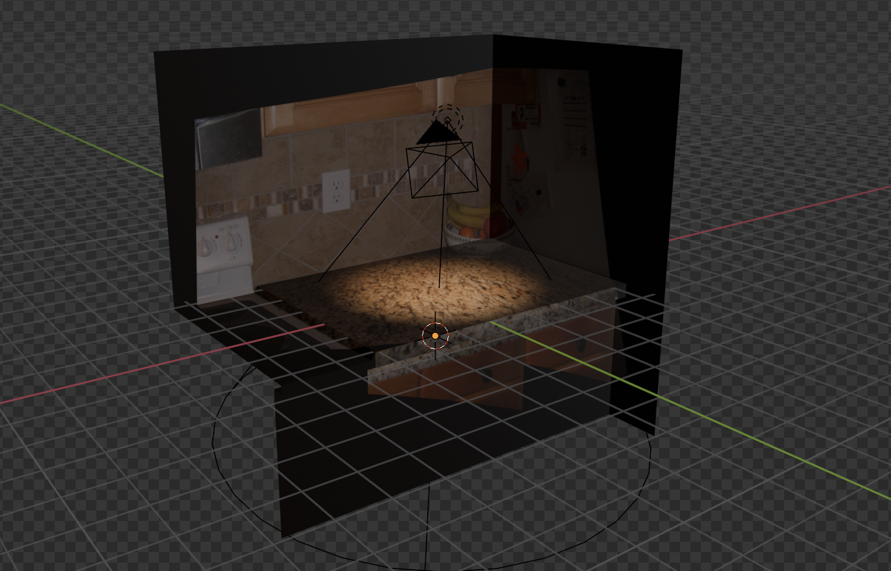

## Gallery

Splash Screen  
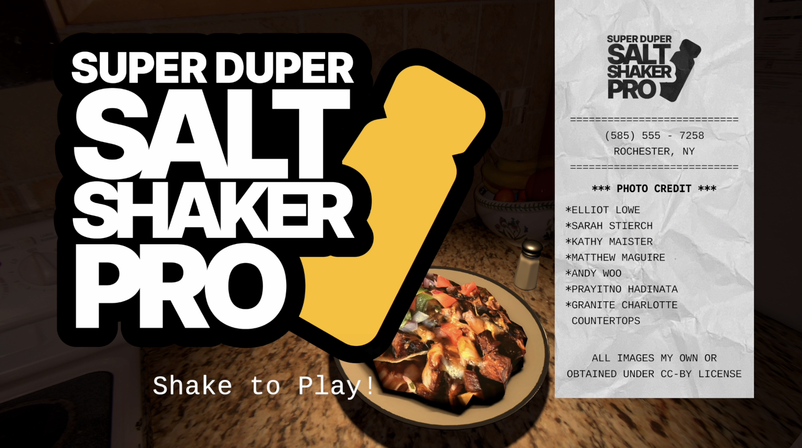  
Round of Gameplay  
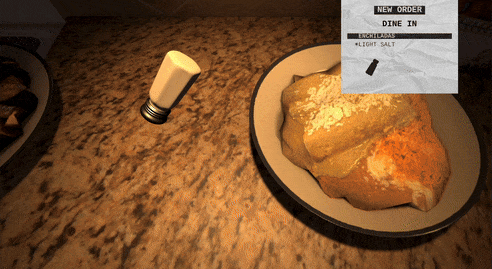  
Game End Screen  
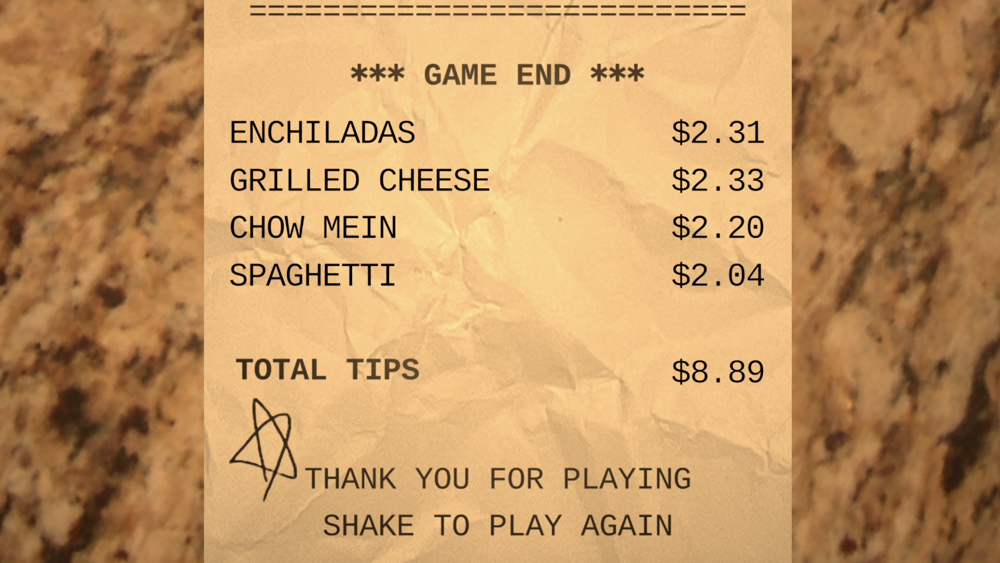  
Salt Shaker Controller  
  
Salt Shaker Inside  

